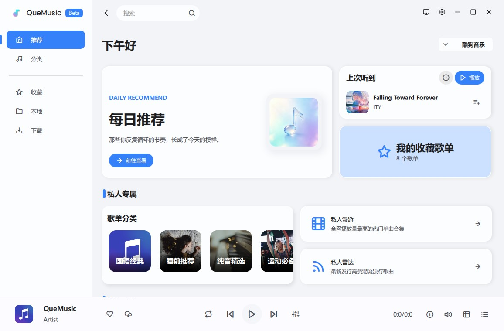
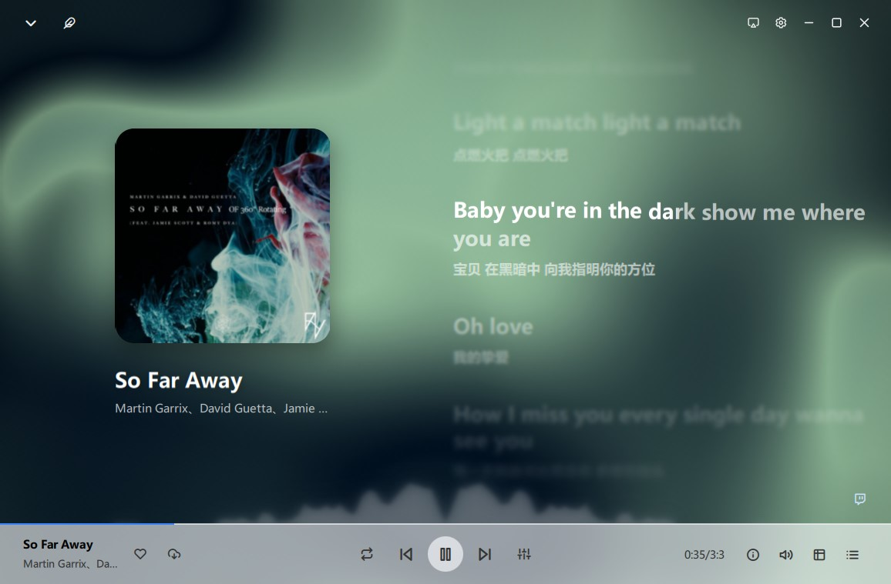
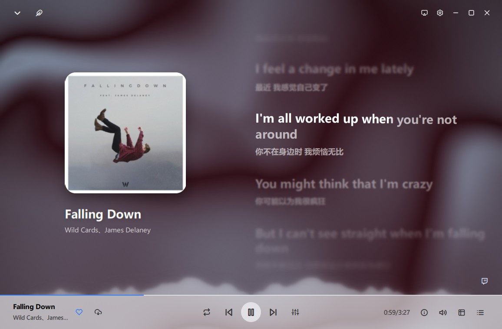
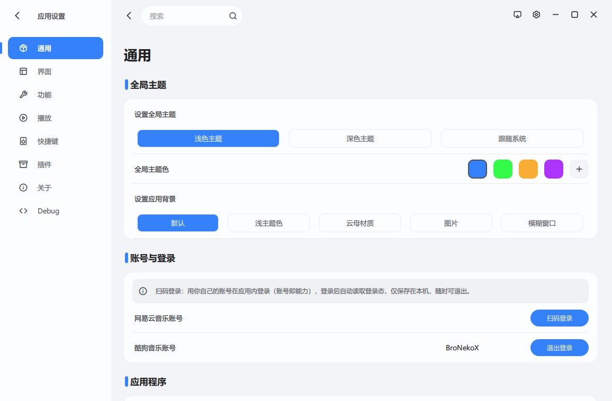

# 🎵 QueMusic Project

<p align="center"></p>

<p align="center"><b>基于 C++20 / Qt 6 / QML 构建的现代高性能跨平台音乐播放器</b></p>

<p align="center">
  
  
  
  
  
  
  
  
</p>

> QueMusic 是一款把「性能」和「手感」放在第一优先级的开源跨平台音乐播放器。
> 计算与 I/O 全部交给 C++ 与工作线程，QML 只负责呈现；渲染走 Qt RHI 的 GPU 管线，动效不掉帧，核显也能稳稳跑满 60 FPS。
> 开发者坚持 **永久免费 & 开源**。
>
> 🚧 项目处于 **开发 / 预览阶段**：功能在持续补齐，部分模块尚未完成，也有已知问题，会一直更新。
> 欢迎 Star & Fork 一起参与 —— 动手前请读 [贡献指南](CONTRIBUTING.md)（含三平台构建方式与提交前自检），
> 想做插件（歌词界面 / 功能）可以直接玩 [QuePlugins](https://github.com/bronekox/queplugins) 插件仓库。

## 📋 必读

### QueMusic官网已推出，快速获取文档及下载内容：[quemusic.top](https://quemusic.top)

#### 国内快速下载本应用及历史版本：

永久下载链接：[下载](https://pan.baidu.com/s/1Z14cgxzb44mi8HauS8F8zA?pwd=63sn) 提取码: 63sn

下载链接随 Release 同步更新。

#### 加入 QQ 群获取最新消息：1105114511

> [!IMPORTANT]
> **macOS 用户必读**：如果打开下载的 `.dmg` 时提示「**已损坏，无法打开**」「无法检查其是否包含恶意软件」或「来自身份不明的开发者」，这是 macOS 对**未公证** App 的拦截 —— **不是文件损坏，也不是中毒**。
> 按 👉 [**macOS 安装说明**](doc/macos-install.md) 操作即可正常打开（一条命令，或不用终端的图形界面做法）。

插件存放位置：[QuePlugins](https://github.com/bronekox/queplugins)

---

> [!WARNING]
>
> 1. 本项目仅供学习与研究使用，禁止用于任何商业用途或非法用途。
> 2. 本项目开发者不接受任何形式的赞助、打赏或捐赠，也禁止任何用户向开发者提供赞助、打赏或捐赠。
> 3. 使用者因使用本项目而产生的任何侵权、盗用、版权等违规情况，与本项目无关。
> 4. 本项目不提供公共云端曲库与媒体分发服务；在线音频获取能力均基于第三方平台的个人账号授权，付费内容、会员内容与受限制内容请遵循第三方平台的版权规定。
> 5. 若音乐平台认为本项目包含侵权或存在问题，可联系开发者进行更改或移除。
> 6. 本项目使用了若干第三方模块，若您认为本项目的使用方式违反其协议，可联系开发者进行更改或移除。

---

<p align="center">
  <a href="#-核心特性">特性</a> •
  <a href="#%EF%B8%8F-技术栈">技术栈</a> •
  <a href="#-引擎架构">引擎</a> •
  <a href="#-安装与运行">安装</a> •
  <a href="#-截图预览">截图</a> •
  <a href="#-项目结构">结构</a> •
  <a href="#-未来计划">计划</a> •
  <a href="#-贡献指南">贡献</a> •
  <a href="#-许可证">许可证</a> •
  <a href="#免责声明">免责声明</a>
</p>

---

## 🖼️ 截图预览

> 项目处于 **开发 / 预览阶段**，先直接看效果（截图中演示的歌曲仅供参考）

<table>
  <tr>
    <td align="center"><br><sub>🏠 主界面</sub></td>
    <td align="center"><br><sub>🎤 歌词页 · 沉浸式</sub></td>
  </tr>
  <tr>
    <td align="center"><br><sub>🎶 歌词页 · 常规</sub></td>
    <td align="center"><br><sub>⚙️ 设置页</sub></td>
  </tr>
</table>

---

## 🔨 快速了解

### QueMusic 是什么？

QueMusic 是一个用 **C++20 + Qt 6 + QML** 写成的跨平台桌面音乐播放器，覆盖 Windows / macOS / Linux。

它没有沿用「Web 内核套壳」的常见路线，而是把整条链路都做成了原生实现：音频解码与 DSP 由自研引擎掌管，界面由 Qt RHI 直接对接系统渲染后端，播放、界面、动画三者互不阻塞。

### QueMusic 有哪些不一样？

- **性能优先**：复杂计算与文件 I/O 全部下沉到 C++ 工作线程，主线程只处理界面；正常使用下内存与 GPU 占用都远低于同类的 Chromium 内核播放器。
- **界面耐看，动画耐跑**：借助 QML Scene Graph 与自定义贝塞尔曲线动画，转场丝滑且稳定，不靠"堆特效"换观感。
- **渲染自己动手**：背景模糊、歌词渐变等效果由自定义 GLSL 着色器实现，通过 Qt RHI 直连系统图形后端，少一层中间开销。
- **功能尽量做全**：本地音乐管理、在线音乐、歌词（含桌面歌词与逐字）、均衡器、歌单与收藏等都在持续完善中。

---

## ✨ 核心特性

QueMusic 的目标很简单：把每个细节都做扎实。

| 维度 | 亮点 |
|------|------|
| **🎶 多平台音乐** | 接入网易云音乐、酷狗音乐、哔哩哔哩等平台的公开接口（仅访问公开内容，详见[免责声明](#免责声明)） |
| **⚡ 性能** | C++ 核心引擎 + QML RHI 场景渲染，核显与老旧 CPU 同样流畅 |
| **🎨 精美 UI** | 毛玻璃圆角卡片、可自定义主题色与界面样式，自研 Theme / 配色系统 |
| **🔄 流畅动画** | 自定义贝塞尔曲线动画，歌词界面逐行丝滑跟唱 |
| **📦 功能丰富** | 歌词滚动 / 桌面歌词、均衡器、歌单管理、搜索推荐、收藏管理 |
| **🛡️ 可靠性** | 统一 API 管理层与错误处理，异常不穿透到界面 |
| **💻 跨平台** | 支持 **Windows / macOS / Linux**（Beta 阶段以 Windows / Linux 为主） |

---

## Que Graph UI

QueMusic 的界面观感来自 Qt RHI 与 QML Scene Graph，但真正决定"稳不稳"的是组件设计本身。目标很明确：**即使核显，GPU 占用也要低，帧时间也要匀。**

- **少嵌套**：能用一个 `Item` 解决的问题不套两层，减少重复绘制与无效变换。
- **定位越简单越贵不了**：优先级为 `x/y/width/height` → `anchors` → `Row/Column` → `Layouts`，越靠前越省。
- **绑定要精**：只让真正变化的属性参与绑定，避免一条数据改动引发整棵子树重算。
- **页面按需加载**：切换页面走异步 `Loader`，重对象在后台线程构建，切页不阻塞主线程喵。

### 自定义渲染

模糊卡片背景、歌词界面的上下渐进模糊都不靠"叠 Effects"，而是直接用自定义着色器实现。

以模糊卡片为例：早期方案是 `ShaderEffectSource` + `MultiEffect`（叠加模糊与饱和度调整），再用一个圆角遮罩把背景源裁进卡片 —— 链路长、开销大。新版把整条链路合并进一个着色器：**取样 → 模糊 → 提饱和 → 圆角裁剪**，并用更高效的模糊算法省掉中途的源截取开销。实现见 [`shaders/cardblur.frag`](shaders) 与 `cardblur_hq.frag`。歌词界面的上下淡入淡出与渐进模糊同理，也是独立着色器。

## Que Audio Engine

音频引擎是 QueMusic 自己握着整条链路的那一层，不依赖系统播放器：

> **FFmpeg 解码线程 → 无锁环形缓冲 → 音频回调线程（DSP + 设备输出）**

- **解码层** — `FfmpegDecoder` 基于 libavformat / libavcodec。解码器固定单线程，避免 FFmpeg 按 CPU 核数额外创建线程上下文与私有缓冲（音频解码并不需要帧级并行）。
- **缓冲层** — `AudioRing` 在解码线程与音频回调线程之间做无锁环形缓冲，两级之间不需要互斥锁，也不靠拷贝等待。
- **输出层** — `QAudioSink` 配合自定义 `QIODevice` 驱动设备输出；缓冲时长（`bufferMs`）、输出采样率与输出设备都可在播放中热切换。
- **DSP 全在音频线程内完成**，与 GUI 调度完全解耦：
  - 多段参数均衡器（`AudioDsp`）：增益、Q 值、前置增益、自动余量（auto headroom）
  - 变速（`TimeStretch`）与变调（`PitchShifter`）互相独立：0.25×–4× 倍速可单独开音调补偿，也可单独移调 ±12 半音
  - 声道处理：左右平衡、单声道折叠、立体声宽度、左右声道互换、左右独立增益
  - ReplayGain 响度归一与限幅器（防削波）
  - 淡变逐样本完成：`fadeTo` / `fadeOut` / `fadeIn` / `fadeInOnNextAudio`。切歌的淡入跟随"新音轨真正出声"的那一刻，而不是靠 QML 计时器猜时间，所以过渡天然自然
- **状态语义对齐 Qt Multimedia**：`PlaybackState` 与 `MediaStatus`（Loading / Stalled / Buffering / Buffered / EndOfMedia / InvalidMedia…）沿用同一套定义，界面层不必为自研引擎改写判断逻辑。
- **频谱可视化**：`AudioSpectrumSink` 把音频线程的采样数据推给可视化组件，波形与歌词动画同源。

## Que NetMedia Engine

在线媒体层是一套「多平台同构」的统一接入层，QML 侧完全感知不到平台差异：

- **平台实现** — `NeteaseCloudApi`（基于 QCloudMusicApi + Crypto++）、`KugouApi`、`BilibiliApi` 暴露完全相同的一组动作签名，并统一回传 `resultReady(action, data, source)` 信号。
- **统一字段层** — `ApiCommon` 把各平台五花八门的返回结构归一到同一套字段（`title` / `artist` / `cover` / `hash` / `hashhq` / `hashsq` / `paytype` / `duration` / `album` / `playcount`），列表模型直接消费，无需在 QML 里写平台分支。
- **调度中枢** — `MusicApiService`（QML 单例 `MusicApi`）按 `source` 分派请求、处理音质选择与降级（标准 128k / 高清 320k / 无损 FLAC，高档缺失时自动回退），并把结果灌入 `OnlineListModel`。
- **配套模块** — `AccountManager` 管理登录态与二维码登录（内置二维码生成）、`DownloadManager` 负责多任务下载与重试、`CoverHelper` 负责封面抓取与磁盘缓存、`ColorExtractor` 从封面提取主色驱动自适应主题。
- **线程模型** — 网络请求、解析与解码全部在工作线程完成，QML 只接收结果信号，主线程零阻塞。

## 🧩 Que Plugins —— 界面里能换的、能加的，都是插件

**一个文件夹就是一个插件**，放进插件目录即被扫描到，不用编译、不用改主程序；设置 → 插件里安装 / 启用 / 删除。
插件只拿到宿主注入的契约，不需要（也不应该）访问应用内部接口。

- **歌词界面插件** — 换掉沉浸播放页的歌词界面（内置「默认 / 自由 / 3D」也跑在同一套契约上）：
  宿主按契约注入播放进度、歌词数据与配色，插件只负责呈现；同时只用一个，播放页左上角第二个按钮随时切换，
  选中项跨启动保留
- **功能插件** — 往界面里加东西：标题栏、底栏、侧栏底部、整窗覆盖层都是开放的扩展点，
  插件用 `api.mount()` 挂自己的按钮或面板（传 `Component` 或 url 都行），可以同时启用多个；
  停用/卸载时宿主回收插件挂出来的一切，插件出错会被自动停用
- **都写得简单** — `info.json` + 入口 QML 即可；`import QueMusic 1.0` 就能用 `Style` / `Playback` / `SButton`
  这些公开单例与组件（歌词界面插件也支持逐字 `info` 与翻译 `translateModel` 两条数据通道）

官方插件仓库与开发规范（含可直接安装的示例插件）：

**[QuePlugins](https://github.com/bronekox/queplugins)** · [歌词界面插件规范](https://github.com/bronekox/queplugins/blob/main/docs/lyrics-plugin.md) · [功能插件规范](https://github.com/bronekox/queplugins/blob/main/docs/function-plugin.md)

---

## 本地歌词加载

本地歌曲的歌词按以下优先级读取：同目录同名 `.lrc` → 音频内嵌歌词 → 在线匹配 → 「纯音乐，请欣赏」占位。

内嵌歌词支持 ID3v2 的同步歌词（SYLT）与非同步歌词（USLT），以及 TagLib 能识别的 `LYRICS` 文本元数据（常见于 FLAC、Ogg/Opus、MP4/M4A）。

## QueMusic 性能实测

在 **i5-12400 + UHD 730 核显**、1080P / 60 FPS 歌词界面下：**CPU 平均占用约 4%，GPU 平均占用约 15%**，全程稳定 60 FPS。

这些数字主要来自四件事：

1. **计算下沉**：数据处理与解码解析全部在 C++ 侧并放到工作线程，主线程不被计算占用。
2. **充分的预编译**：QML 与 JavaScript 全部标注静态类型，`qmlcachegen` 才能把绑定与函数编译成 C++ / 字节码，而不是留到运行期解释；Release 另开 LTO、函数分节与 PCH。
3. **克制的组件框架**：拒绝深嵌套，页面与布局按需异步加载，自研组件库整体保持轻量，内存与渲染压力都更低。
4. **一直在调**：性能不是一次性的成绩，而是一个持续在做的过程喵。

---

## 🛠️ 技术栈

| 类别 | 技术 |
|------|------|
| **框架** | Qt 6.10.3 Community（Core / Gui / Quick / Qml / Network / Multimedia / Sql / Concurrent / ShaderTools） |
| **语言** | C++20 / QML / JavaScript |
| **构建** | CMake ≥ 3.24（内置预设）/ Ninja；Release 默认开启 LTO 与 PCH |
| **音频** | FFmpeg（libavformat / libavcodec）解码 + 自研 DSP（均衡 / 变速 / 变调 / 响度归一 / 限幅） |
| **渲染** | Qt RHI —— 直连平台原生 GPU 后端（D3D11 / Metal / Vulkan / OpenGL），自定义 GLSL 着色器 |
| **界面** | Qt Quick + 自研 QML 组件库 + QWindowKit 无边框窗口 |
| **元数据** | TagLib（本地标签与内嵌歌词）/ SQLite（收藏、曲库索引） |
| **在线接口** | QCloudMusicApi + Crypto++（网易云）/ 自研酷狗、哔哩哔哩接口层 |
| **工具链** | MSVC 2022 / GCC 13+ / MinGW 13+ / LLVM-MinGW 17+ |

---

## 📥 安装与运行

### 前置条件

- Qt **6.10+**（含 Qt Multimedia、Qt SQL、Qt ShaderTools 等基础库）
- CMake ≥ **3.24**（需要其预设文件支持）
- 编译器：GCC 13+ / MinGW 13+ / LLVM-MinGW 17+ / Clang / MSVC 2022
- **FFmpeg 开发库**（解码层的依赖）：
  - Windows：`powershell -ExecutionPolicy Bypass -File cmake/fetch_ffmpeg.ps1`（解压到仓库根目录的 `ffmpeg/`，该目录已在 `.gitignore` 中）
  - Linux：`sudo apt install libavcodec-dev libavformat-dev libavutil-dev libswresample-dev pkg-config`
  - Arch：`sudo pacman -S ffmpeg pkgconf`
  - 也可以 `-DQUEMUSIC_FFMPEG_ROOT=<ffmpeg prefix>` 指定已有安装
- （可选）**Ninja** 构建系统（推荐，已内置在预设中）

### 克隆（含子模块）

```bash
git clone --recurse-submodules https://github.com/BroNekoX/QueMusic.git
cd QueMusic
```

> ⚠️ **重要**：本项目使用 QWindowKit、TagLib、Crypto++ 作为 git 子模块，务必加上 `--recurse-submodules`。
> 如果已经 clone 但忘记拉子模块，执行：
>
> ```bash
> git submodule update --init --recursive
> ```

### 快速构建

项目内置 `CMakePresets.json`，推荐直接用预设构建：

#### 1. 使用 just 构建与运行

> 需要先安装 [just](https://github.com/casey/just)，然后：

```bash
just setup  # 首次使用：拉取子模块
just b      # 构建
just r      # 运行
```

#### 2. 使用 CMake 构建

```bash
# 配置（选择预设）
cmake --preset <preset-name>

# 编译
cmake --build build/<preset-name> -j 8

# 运行
./build/<preset-name>/bin/QueMusic        # Linux / macOS
./build/<preset-name>/bin/QueMusic.exe    # Windows
```

可用预设：

| 平台 | 预设名 | 编译器 |
|------|------|------|
| Windows | win-llvm-mingw-release | LLVM-MinGW（Qt 6.10 的 `llvm-mingw_64` 套件） |
| Windows | win-mingw-release | MinGW（Qt 的 `mingw_64` 套件） |
| Linux | linux-gcc-release | GCC |
| macOS | mac-clang-release | Clang |

> 💡 如果 CMake 找不到 Qt，请先设置环境变量 `CMAKE_PREFIX_PATH` 指向 Qt 安装目录（例如 `~/Qt/6.10.3/llvm-mingw_64` 或 `~/Qt/6.10.3/gcc_64`）。

### 手动构建

#### Windows（LLVM-MinGW / MinGW）

```bash
# LLVM-MinGW（Qt 6.10 推荐）
cmake -B build -G Ninja \
  -DCMAKE_C_COMPILER=clang -DCMAKE_CXX_COMPILER=clang++ \
  -DCMAKE_PREFIX_PATH=/path/to/Qt/6.10.3/llvm-mingw_64
cmake --build build --parallel
./build/bin/QueMusic

# MinGW
cmake -B build -G Ninja \
  -DCMAKE_PREFIX_PATH=/path/to/Qt/6.10.3/mingw_64
```

#### Linux

```bash
cmake -B build -DCMAKE_BUILD_TYPE=Release \
  -DCMAKE_PREFIX_PATH=~/Qt/6.10.3/gcc_64
cmake --build build -j"$(nproc)"
./build/bin/QueMusic
```

#### macOS

```bash
cmake -B build -DCMAKE_BUILD_TYPE=Release \
      -DCMAKE_PREFIX_PATH=~/Qt/6.10.3/clang_64 \
      -DCMAKE_OSX_DEPLOYMENT_TARGET=11.0
cmake --build build -j 8
./build/bin/QueMusic.app/Contents/MacOS/QueMusic
```

> 📦 三种平台的可执行安装包都会随 [Release](https://github.com/BroNekoX/QueMusic/releases) 发布。

### 打包分发

- **Windows**：`windeployqt` + Inno Setup（可选）分步打包。
- **Linux**：运行 `bash packaging/build-linux.sh` 生成 AppImage。
- **macOS**：运行 `just mac-bundle` 生成 `.dmg`（需已安装 `macdeployqt`）。

---

## 📁 项目结构

```
QueMusic/
├── CMakeLists.txt              # 顶层构建配置
├── CMakePresets.json           # 各平台构建预设
├── cmake/                      # CMake 模块
│   ├── external/               # 子模块（QWindowKit / TagLib / zlib）快速集成
│   ├── qmltc.cmake             # qmltc 类型编译（实验性，默认关闭）
│   ├── qtruntime.cmake         # 运行库部署与裁剪
│   └── fetch_ffmpeg.ps1        # Windows 侧 FFmpeg 开发库拉取
├── main.cpp                    # C++ 程序入口
├── main.qml                    # QML 主入口（窗口 / 全局单例装配）
├── FullCenterView.qml          # 沉浸中心视图
├── SettingsView.qml            # 设置页
├── cpp/                        # C++ 后端
│   ├── audio/                  # 音频引擎：AudioEngine / FfmpegDecoder / AudioDsp
│   │                           #            AudioRing / PitchShifter / TimeStretch
│   │                           #            AudioSpectrumSink
│   ├── CoverHelper.cpp/h       # 封面提取与磁盘缓存
│   ├── ColorExtractor.cpp/h    # 封面取主色（自适应主题）
│   ├── GetWave.cpp/h           # 音频波形数据
│   ├── FolderModel.cpp/h       # 本地文件夹与歌曲模型
│   ├── Favorites.cpp/h         # 收藏模型
│   ├── DownloadedMusicModel.*  # 已下载音乐模型
│   ├── DownloadManager.cpp/h   # 下载管理器
│   ├── LocalMusicScanner.cpp/h # 本地曲库扫描
│   ├── LocalLyricsReader.cpp/h # .lrc 与内嵌歌词读取
│   ├── DbService.cpp/h         # 数据库线程化服务
│   ├── PlayerDatabase.cpp/h    # 曲库索引
│   ├── AccountManager.cpp/h    # 账号与登录态
│   ├── LogManager.cpp/h        # 日志
│   └── SystemTrayManager.*     # 托盘与系统媒体控件（SMTC）
├── api/                        # 在线媒体引擎
│   ├── MusicApiService.cpp/h   # 调度中枢（QML 单例 MusicApi）
│   ├── ApiCommon.h             # 统一字段层
│   ├── KugouApi.cpp/h          # 酷狗音乐
│   ├── NeteaseCloudApi.cpp/h   # 网易云音乐
│   ├── BilibiliApi.cpp/h       # 哔哩哔哩
│   ├── OnlineListModel.cpp/h   # 在线列表模型
│   └── QCloudMusicApi/         # 第三方：网易云接口实现
├── components/                 # 自研 QML 组件库
│   ├── Q***.qml                # 各类控件，界面由它们拼装而成
│   ├── MusicApi.qml            # 在线音乐整合单例
│   ├── Style.qml               # 全局视觉单例
│   └── Options.qml             # 配置与版本号
├── layout/                     # 页面布局
│   ├── LeftSideBar.qml         # 左侧导航栏
│   ├── MainContent.qml         # 主内容区（页面容器）
│   ├── PlayerControl.qml       # 播放控制栏
│   ├── PlayerMaxCenter.qml     # 最大化 / 全屏播放中心
│   └── MainLyric.qml           # 歌词视图
├── pages/                      # 普通模式页面
│   ├── HomePage.qml            # 首页 / 推荐
│   ├── SearchPage.qml          # 搜索
│   ├── PlaylistPage.qml        # 歌单详情
│   ├── FavouritePage.qml       # 收藏
│   ├── FilePage.qml            # 本地文件
│   └── DownloadPage.qml        # 下载管理
├── centers/                    # 沉浸中心模式的对应页面
├── lyricsui/                   # 歌词界面实现（自由 / 3D 等）
├── shaders/                    # GLSL 着色器与对应 C++ 材质
├── resources/                  # 资源
│   ├── app/                    # 应用图标与图片
│   ├── fonts/                  # 字体（Poppins、Feather Icons）
│   ├── window-bar/             # 窗口按钮图标
│   └── pic/                    # 背景图片
├── packaging/                  # 各平台打包脚本
├── doc/                        # 文档与文档配图
├── ThirdParty/
│   └── qwindowkit/             # Git 子模块 —— 无边框窗口框架
├── LICENSE                     # Apache License 2.0
├── NOTICE                      # 第三方依赖声明
└── README.md
```

---

## 🎮 未来计划

- **功能完善（首要）**：补全设置、编辑与歌单管理，增强整体稳定性。
- **音源插件化**：把播放核心与在线音源解耦，音源作为可插拔模块，由使用者自行配置与负责。
- **品牌统一**：统一名称与视觉形象，让项目形象更清晰。
- **社区建设**：推出 QueMusic 官网，与 QQ 群一起把生态做起来。
- **性能持续优化**：继续压内存与 GPU 占用，清理性能瓶颈。
- **沉浸播放**：参考 Folia / MineRadio 的思路，引入 3D 可视化与高度自定义歌词。
- **UI 打磨**：继续完善自研 QML 组件库，统一设计语言。
- **国际化**：可选方向（由于主要接入国内音乐平台，不一定推进）。
- **插件体系**：自定义插件与主题 UI 插件系统。

无论更新到哪一步，QueMusic 都保持开源免费、没有付费内容。但歌曲版权归平台所有，请自行购买 VIP 或付费歌曲，并登录平台账号收听（功能即将更新）。

---

## 🤝 贡献指南

欢迎任何形式的贡献：

| 方式 | 说明 |
|------|------|
| 🐛 **报告 Bug** | 提交 [Issue](https://github.com/bronekox/quemusic/issues)，附上复现步骤与环境信息 |
| 💡 **提出新功能** | 在 [Discussion](https://github.com/bronekox/quemusic/discussions) 中发起讨论 |
| ⭐ **Star** | 点亮 GitHub Star，支持项目持续开发 |
| 🧪 **测试** | 构建并试用，反馈兼容性问题 |
| 🔧 **Pull Request** | 修复 Bug、优化代码、完善功能 —— **欢迎任何人** |
| 📖 **复用** | 项目基于 Apache-2.0，欢迎其他项目使用本项目代码 |

### 开发流程

1. Fork 本仓库
2. 创建功能分支：`git checkout -b feat/your-feature`
3. 提交修改：`git commit -m "feat: add xxx"`
4. 推送：`git push origin feat/your-feature`
5. 发起 Pull Request

> 代码风格请参考现有文件，遵循 **C++20 / Qt 6 / QML best practices**。

---

## 📄 许可证

本项目主体遵循 **Apache License 2.0** —— 欢迎自由使用、修改、分发，商用亦可（需保留版权声明与许可证副本）。

```
Apache License
Version 2.0, January 2004
Copyright (c) 2025-2026 QueMusic Contributors
```

> 💡 **Apache-2.0 要点**：允许商用、修改与分发；衍生作品需保留原始版权声明与 NOTICE；对专利授权有明确条款，为用户提供额外保护。

---

## 🎨 背景着色器变更

**Beta 0.5.0** 之前的版本使用了 [AMLL-Core(Apple Music Like Lyrics)](https://github.com/amll-dev/applemusic-like-lyrics) 项目的背景着色器并移植到 Qt。

开发者清楚这种做法可能触及许可证边界 —— 虽然做了相对合规的处理，但为了让项目走得更稳、更远，最终决定更换实现。

**Beta 0.5.0** 之后的版本改用自研框架的背景着色器，并提供多个可选效果替代此前的 AMLL 背景：

- **Fluid**：移植自 [Paper-design/shaders](https://github.com/paper-design/shaders)，该项目使用 Apache License 2.0，引用完全合规。
- **Classic**：自研实现，观感上尽量靠拢 AMLL。参考了 AMLL 的实现思路，但算法、代码与数值均未直接照搬，所用算法均为公开算法。

> **Classic** 的大致思路：
> 封面预处理：封面 → 高斯模糊 → 后处理（亮度 / 饱和）→ 作为背景贴图源；
> 背景渲染：贴图源 → 多次重复取样 → 旋转 → 3D 变形背景 → 后处理（暗角、抖动、噪声）→ 输出到组件显示区域。

受着色器更换影响，效果可能不如 **0.5.0** 之前的版本华丽。后续会持续优化背景效果，把它做得更好看。

---

## 📢 免责声明

### 1. 音乐版权

本项目中的所有音乐内容（歌曲、歌词、封面等）版权均归其原始权利人所有。本项目**不提供、不存储、不缓存**任何音乐文件，所有播放内容均来自用户自行选择的第三方公开网络服务。

### 2. 在线服务接口

- 本项目仅调用各音乐平台对外**公开**的接口，**不包含任何破解、绕过付费、解锁 VIP、盗取音源等行为**；
- 不提供任何付费内容的非法获取途径，也无法播放需要单独授权的加密内容；
- 各平台接口可能随时调整或失效，本项目不对接口的可用性与稳定性作任何保证。

### 3. 商标与品牌

本项目中出现的所有商标、产品名称、服务名称均为其各自所有者的财产，仅用于描述兼容性，不代表任何官方授权、认可或关联。

### 4. 使用者责任

使用者应遵守所在地法律法规以及各第三方平台的服务条款。因使用本项目而产生的任何直接或间接后果，由使用者自行承担，项目开发者不承担任何责任。

### 5. 无担保

本项目按 **"现状"（AS-IS）** 提供，不附带任何明示或暗示的担保。详细免责条款请参阅 [LICENSE](LICENSE) 文件。

---

## 🙏 致谢

- [Qt Project](https://www.qt.io/) — 提供强大的跨平台框架
- [QWindowKit](https://github.com/stdware/qwindowkit) — 无边框窗口解决方案
- [qiuliw/Qt6_QWindowKit_QML_demo](https://github.com/qiuliw/Qt6_QWindowKit_QML_demo) — 项目框架参考
- [QCloudMusicApi](https://github.com/s12mmm3/QCloudMusicApi) — 网易云音乐在线接口实现
- [Crypto++](https://github.com/weidai11/cryptopp) — 用于 QCloudMusicApi 的加解密
- [libqrencode](https://github.com/fukuchi/libqrencode) — 二维码生成
- [TagLib](https://github.com/taglib/taglib) — 本地音乐标签与内嵌歌词解析
- [SMTC-Bridge-Cpp](https://github.com/Cainongw/SMTC-Bridge-Cpp) — Windows 系统媒体控件（SMTC）桥接参考实现（C++）
- [smtc_bridge_rust](https://github.com/Cainongw/smtc_bridge_rust) — Windows 系统媒体控件（SMTC）桥接参考实现（Rust）
- [Paper-design/shaders](https://github.com/paper-design/shaders) — 背景着色器 "Fluid" 的算法移植

#### 其他对本项目有帮助的

- [EvolveUI](https://evolveui.top/) — 部分组件设计参考
- [AMLL-Core(Apple Music Like Lyrics)](https://github.com/amll-dev/applemusic-like-lyrics) — 背景着色器实现方法参考
- [ShaderToy](https://www.shadertoy.com/) — 着色器灵感来源
- 以及所有贡献者与测试者

---

## QueMusic Pro 高级版

### 不可能存在的喵！！！

QueMusic 官方版本始终保持开源与永久免费，没有任何 Pro、Ultra、高级版、捐献版等版本，也不存在任何付费、会员、捐献、充值或赞助内容。如果你遇到需要付费的 QueMusic本体，或发现其中存在付费项目，请立即告知开发者。

---

## 联系开发者

- QQ：241422517
- 邮箱：uihugd@outlook.com
- Bilibili：695207057
- QQ 群：1105114511

---

<p align="center">
  <sub>Written for QueMusic Project</sub><br/>
  <sub>最后更新：2026-10-09 · 版本 0.6.0</sub>
</p>
